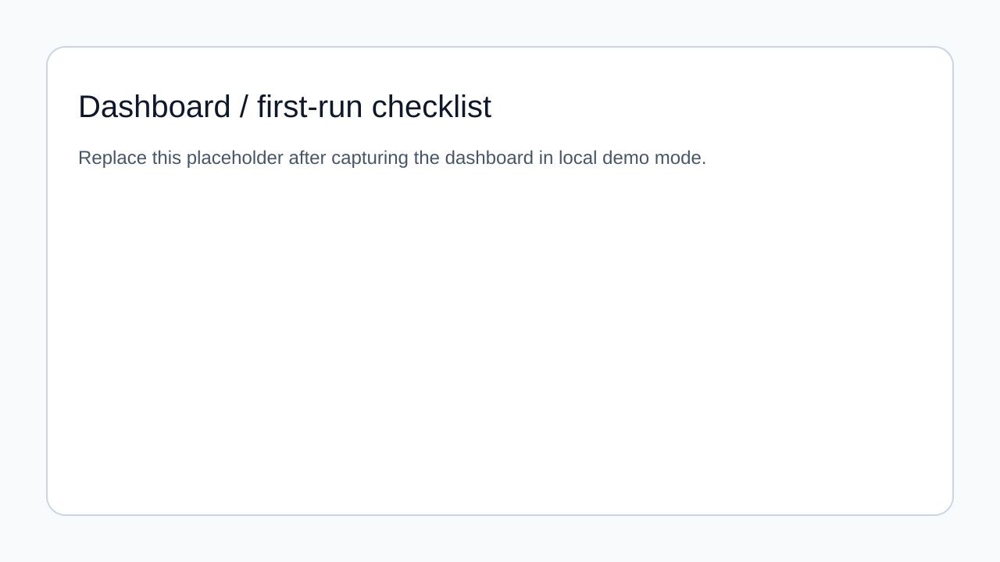
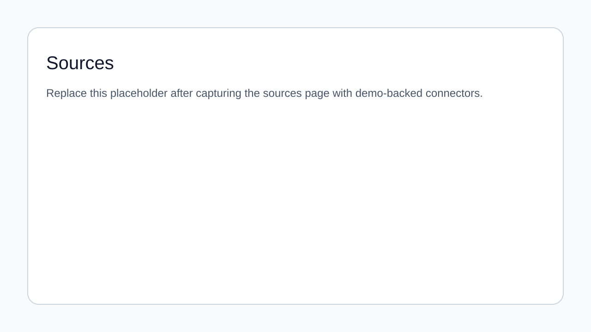
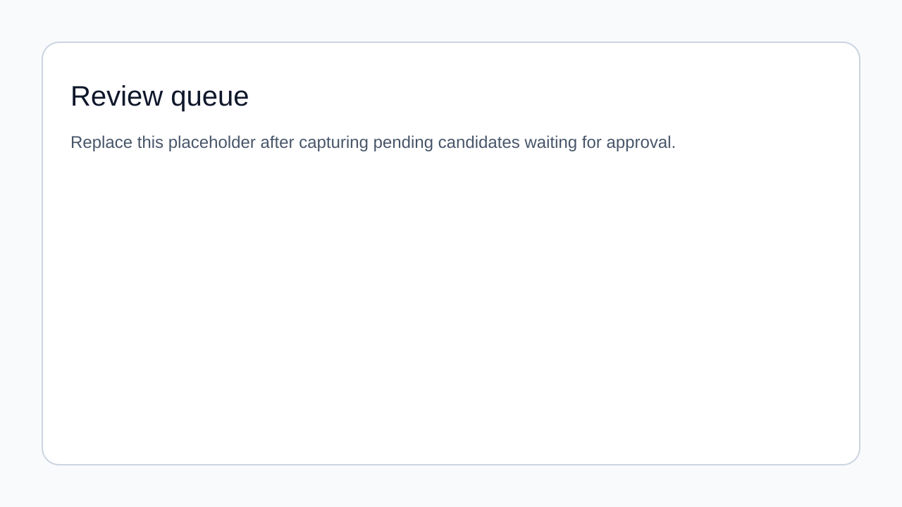
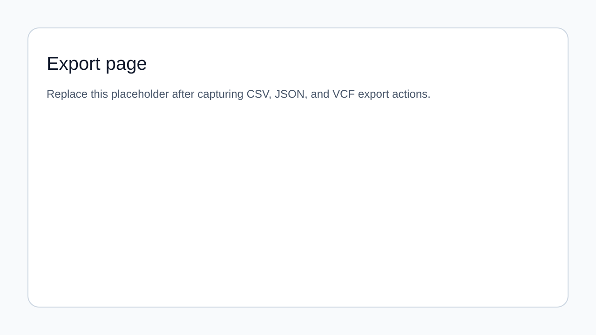
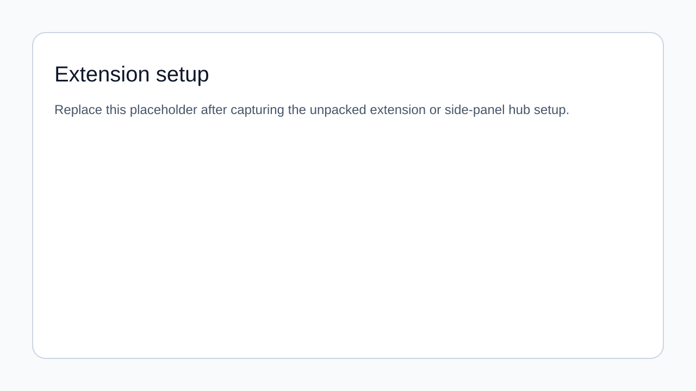
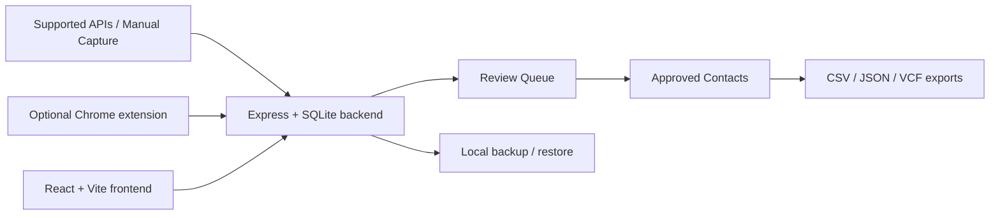

# ContactBridge

> **Status: Local-first beta**
>
> ContactBridge is a local-first contact review hub for people who want to import contacts from supported sources, manually capture public profiles with an optional browser extension, review candidate matches, and export only the contacts they approve.
>
> **Hosted multi-user warning:** hosted mode exists for productization work only. Do **not** expose it to real users yet.

## What ContactBridge is

ContactBridge helps a single operator collect social/contact data from supported sources into one local review queue. It keeps imports reviewable, keeps export decisions explicit, and keeps the beta focused on local workflows instead of SaaS hosting.

## Who it is for

- Individual users testing a local-first contact hub
- Developers evaluating provider integrations and export flows
- Beta testers validating manual extension capture and review workflows
- Contributors working on a privacy-conscious single-operator product

## What it does today

- Imports contacts from Bluesky, GitHub, Google Contacts, Mastodon, and X
- Supports manual public-profile capture from LinkedIn, X, Bluesky, and XING with the browser extension, plus visible LinkedIn overview-page import
- Keeps imported identities in a review queue until you approve them
- Exports approved contacts as CSV, JSON, or VCF
- Supports local backup, restore, and full local reset in `APP_MODE=local` or `APP_MODE=test`
- Supports safe demo flows with bundled fixture data via `npm run demo`
- Keeps demo fixture syncs local and credential-free for fixture-backed provider coverage, including X
- Provides smoke verification with `npm run smoke`

## Known limitations

- Local-first single-operator beta only
- No hosted accounts
- No multi-user isolation
- No SaaS deployment support
- Hosted mode is **not** ready for real users
- No background scraping or silent capture
- Production extension hub origins must be explicitly packaged before distribution

## Quickstart (local-first beta)

```bash
git clone https://github.com/voku/ContactBridge.git
cd ContactBridge
npm ci
cp .env.example .env.local
npm run demo
```

Then open <http://localhost:3000> and:

1. Confirm the **Dashboard** first-run checklist is green enough to continue.
2. Open **Sources** and connect one demo-backed source.
3. Review and approve at least one candidate in **Review Queue**.
4. Download CSV, JSON, or VCF from **Export Data**.
5. Run `npm run smoke` in a second terminal.

### Local beta defaults

Keep `.env.local` aligned with the beta flow:

- `APP_MODE=local`
- `APP_URL=http://localhost:3000` when testing OAuth callbacks locally
- `CONTACTBRIDGE_DEMO_DATA_DIR=./test/demo-data` for demo fixtures
- Leave `VITE_API_BASE_URL` unset for same-origin local usage
- Ignore `CONTACTBRIDGE_SECRET_KEY` unless you are explicitly testing hosted mode

## Product tour

Lightweight placeholders live in [`docs/assets/`](docs/assets/README.md) until final screenshots are captured.

| View | Preview |
| --- | --- |
| Dashboard / first-run checklist |  |
| Sources |  |
| Review queue |  |
| Export page |  |
| Extension setup |  |

## Demo and verification

- Full walkthrough: [`docs/DEMO_WALKTHROUGH.md`](docs/DEMO_WALKTHROUGH.md)
- Beta release checklist: [`docs/BETA_RELEASE_CHECKLIST.md`](docs/BETA_RELEASE_CHECKLIST.md)
- Changelog: [`CHANGELOG.md`](CHANGELOG.md)
- Release process: [`docs/RELEASE_PROCESS.md`](docs/RELEASE_PROCESS.md)
- Manual QA checklist: [`docs/MANUAL_QA_BETA.md`](docs/MANUAL_QA_BETA.md)
- Release notes: [`docs/RELEASE_NOTES_BETA.md`](docs/RELEASE_NOTES_BETA.md)
- Screenshot capture guide: [`docs/SCREENSHOT_CAPTURE.md`](docs/SCREENSHOT_CAPTURE.md)
- Local-first beta boundaries: [`docs/LOCAL_FIRST_BETA.md`](docs/LOCAL_FIRST_BETA.md)
- Extension packaging: [`docs/EXTENSION_PACKAGING.md`](docs/EXTENSION_PACKAGING.md)

Run the main verification commands before opening a PR:

```bash
npm run test:integration
npm run lint
npm run build
npm run smoke
```

## Architecture overview



### Repository structure

- `src/`: React + Vite frontend
- `server.ts`: Express API, local runtime boundaries, sync logic, export routes, and backup/restore routes
- `src/lib/db/schema.ts`: Drizzle schema for persisted data
- `extension/`: Chrome extension for manual capture
- `docs/`: beta release, demo, and packaging documentation

## Scripts

- `npm run dev`: start the local Express + Vite app
- `npm run demo`: start the app with bundled demo fixtures enabled
- `npm run test:integration`: run backend integration tests with bundled demo fixtures and no real provider API calls
- `npm run lint`: run TypeScript checks
- `npm run build:client`: build the static frontend only
- `npm run build`: build the frontend and bundle the Node server
- `npm run start`: run the production server bundle
- `npm run smoke`: verify `/api/health`, `/api/status`, `/api/extension/health`, export endpoints, and local backup availability against `http://127.0.0.1:3000` (or `CONTACTBRIDGE_BASE_URL`)

## Keywords

local-first, privacy-conscious, contact review, manual capture, export workflow, browser extension, SQLite

## Browser extension

The Chrome extension lives in `extension/` and supports manual capture from LinkedIn, X, Bluesky, and XING, plus visible LinkedIn overview-page import.

- Load it unpacked for local beta use
- Repository-scoped Modern Web Guidance skills live in `.claude/skills/modern-web-guidance/` and `.agents/skills/modern-web-guidance/` for future extension/UI work
- The side panel validates `${hub}/api/extension/health` before saving a hub URL
- The side panel automatically re-checks the active tab when focus, permissions, or saved hub configuration changes
- Optional host permissions mean access is only granted to the sites you explicitly enable
- Packaged production builds must explicitly include any non-local hub origins before distribution

See [`docs/EXTENSION_PACKAGING.md`](docs/EXTENSION_PACKAGING.md) for packaging and safety guidance.

## Export API endpoints

Frontend export buttons download server-generated files from:

- `GET /api/exports/contacts.csv`
- `GET /api/exports/contacts.json`
- `GET /api/exports/contacts.vcf`

Only approved candidates are exported.

## Local backup and restore

Local and test modes expose:

- `GET /api/database/backup`
- `POST /api/database/restore` with `x-contactbridge-confirm-restore: restore-local-data`
- `DELETE /api/database` with `x-contactbridge-confirm-reset: erase-local-data`

Hosted mode keeps backup/restore/reset blocked.

## Hosted mode boundary

ContactBridge is not hosted multi-user ready yet. Before any public hosted rollout, it still needs authentication, authorization, per-user isolation, and additional browser/server security hardening.

Hosted mode fails closed at startup:

- Invalid `APP_MODE` values stop startup
- `CONTACTBRIDGE_SECRET_KEY` is required before startup completes
- CORS requires an explicit origin allowlist and rejects no-origin requests

## GitHub Pages frontend deployment

This repository includes a GitHub Actions workflow that deploys the Vite frontend to GitHub Pages on pushes to `main`.

Important:

- GitHub Pages hosts the frontend only
- The API, OAuth callbacks, and SQLite database still require a separate backend deployment
- Set `VITE_API_BASE_URL` in your frontend environment if the backend lives on another origin
- Do not treat GitHub Pages deployment as hosted SaaS readiness

The workflow uses:

- `VITE_BASE_PATH=/ContactBridge/`

If you fork this repository, update `.github/workflows/deploy-pages.yml` and the canonical social URLs in `index.html`.
